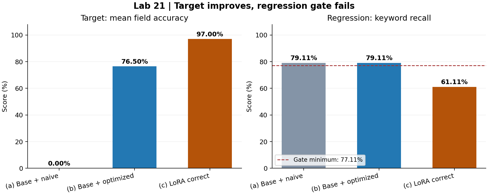
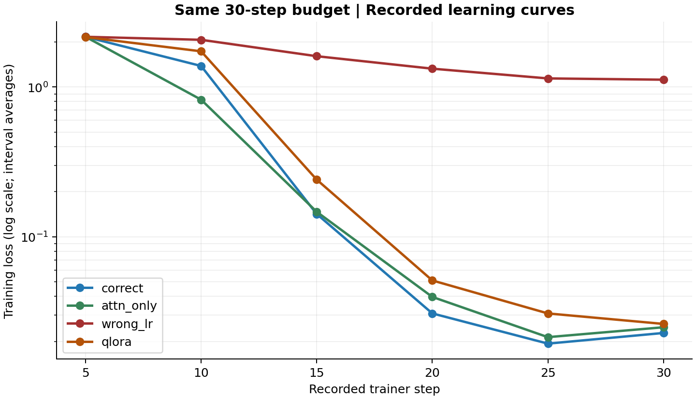

# Lab 21 — Fine-tuning cho ticket CSKH tiếng Việt

**Họ tên:** Thân Tiến Đạt

**MSSV:** 2A202603023

**Ngày chạy:** 07/10/2026

**Tier:** T4 · **Base model:** unsloth/Qwen3.5-4B · **GPU thực tế:** Tesla T4, 14.56 GiB theo runtime.

**Kết luận:** LoRA tăng độ chính xác từng trường từ 76,5% lên 97%, nhưng điểm regression giảm 18 điểm phần trăm. Cổng hồi quy **FAILED**; chưa nên dùng adapter correct để thay thế model đa dụng.

## 1. Lựa chọn và thiết kế thí nghiệm

Tôi chọn corpus mặc định gồm 250 ticket CSKH tiếng Việt, đầu ra JSON có bốn trường `intent`, `urgency`, `product`, `sentiment`. Bài toán có nhãn rõ và chấm bằng mã, nên phù hợp để phân biệt cải thiện thật trên tác vụ với việc loss huấn luyện giảm. Tôi giữ 50 mẫu target và 15 mẫu regression riêng. NB1 chia 225 train/25 val với seed 42; trainer dùng tập train, còn val được lưu dự phòng và không tham gia chấm trong trainer hiện tại.

Tôi giữ model và tier mặc định để tập trung vào mask, baseline và cấu hình LoRA. Máy cá nhân có GTX 1650 4 GB VRAM; Colab T4 đủ cho cấu hình này. Độ chính xác được so với chính base model đã dùng prompt tối ưu, không chỉ với prompt sơ sài. NB2 đóng băng baseline trước NB3 theo luồng notebook; hash prompt và hash eval được đối chiếu lại khi đọc kết quả.

| Cấu hình | Giá trị đã chạy |
|---|---|
| Model | unsloth/Qwen3.5-4B |
| Epochs / ngân sách step | 2 / 30 cho cả bốn run |
| Mask | assistant-only |
| max_length | 1024 |
| Batch train / tích luỹ gradient / batch hiệu dụng | 1 / 16 / 16 |
| Seed | 42 |
| Precision | fp16 autocast trên T4; không đặt bf16 cho thiết bị này |
| Packing / padding_free | tắt |
| Đánh giá | đủ 50 target và 15 regression; EVAL_LIMIT không đặt; greedy decoding |

Phiên bản thực tế: torch 2.11.0+cu130, transformers 5.18.0, TRL 1.14.2, PEFT 0.21.1, accelerate 1.15.0, datasets 5.1.0, bitsandbytes 0.50.2, torchao 0.18.0. Danh sách đầy đủ nằm ở `results/requirements-lock.txt`; thông tin runtime tại `results/environment.json`.

## 2. Mask proof, template và độ dài

Trên mẫu proof, có **39/94 token** được tính loss, `supervised_fraction=0.4149`. Hai assert đều đúng: `answer_is_supervised=true` và `question_is_masked=true`. Đây là bằng chứng trên mẫu được kiểm tra, không phải tỷ lệ trung bình toàn corpus. Đoạn được tính loss là:

```text
</think>

{"intent": "doi_tra", "urgency": "trung_binh", "product": "balo laptop", "sentiment": "trung_tinh"}<|im_end|>
```

Template kiểm tra có cả thẻ mở và nội dung trace: `ok=true`, `open_tag_present=true`, `body_present=true`; nội dung reasoning được giữ. Tuy nhiên corpus train của lần này chứa câu trả lời JSON, không có trace suy luận thực. `valid_trace_rate=0.0` trên target vì vậy không đủ để kết luận reasoning-trace collapse; sinh văn bản còn đặt `enable_thinking=False`.

Độ dài đo trên 250 mẫu: mean=93.1, p50=93, **p95=98**, p99=100, max=101; hàm của lab đề xuất `max_length=256`. Tôi giữ `1024` để chạy nguyên cấu hình T4 và bảo đảm bốn đối chứng dùng cùng giới hạn; không sửa cấu hình sau khi đã thấy kết quả. Đây là lựa chọn bảo thủ, lớn hơn cần thiết trên corpus này. Không có mẫu đo nào dài tới giới hạn nên việc này không cắt câu trả lời; nhưng nó chưa phải bằng chứng 1024 là tối ưu. Trong lần chạy mới, nên thử 256 có kiểm soát. Với batch train=1, không thể suy ra giảm giới hạn bốn lần sẽ giảm bốn lần VRAM hoặc thời gian.

## 3. Baseline đóng băng và bốn nhóm đánh giá

Prompt (b) không được sửa so với mã đã chuẩn bị; SHA ghi nhận là `719e74d3b6232053`. (b) đạt target=0.765 và thắng rõ (a)=0.0 trước khi train, nên baseline cần vượt là một mốc có năng lực trên tác vụ. Fine-tune được chấm với prompt ngắn của (a); hành vi JSON đã được học vào adapter.

| run | target | regression | format | latency_ms | n |
|---|---|---|---|---|---|
| (a) base + naive prompt | 0.0 | 0.7911 | 0.0 | 3400.3 | 50 |
| (b) base + optimized prompt | 0.765 | 0.7911 | 1.0 | 1063.7 | 50 |
| (c) LoRA fine-tune | 0.97 | 0.6111 | 1.0 | 1409.2 | 50 |

Target ở đây là **trung bình độ chính xác bốn trường**, không phải tỷ lệ ticket đúng toàn bộ. Correct đúng 194/200 trường, tương đương 97%; 44/50 ticket đúng cả bốn trường, tương đương 88%. Baseline (b) đúng 153/200 trường và 13/50 ticket đúng toàn bộ. Format=1.0 có nghĩa harness phục hồi được JSON và đủ bốn khóa bắt buộc; parser chấp nhận cả JSON được nhúng trong văn bản, nên không nên diễn giải chỉ số này thành 100% JSON nghiêm ngặt không có nội dung thừa.

Correct tăng target **20,5 điểm phần trăm** so với (b), giữ format=1.0, nhưng latency tăng từ 1063.7 lên 1409.2 ms/mẫu, khoảng **32,48%**. Latency là thời gian sinh trung bình trên các batch eval, không phải P95/P99 của một dịch vụ. Không có phép đo độ nhiễu qua nhiều lần chạy, nên không coi chênh lệch thời gian là hằng số của model.



Biểu đồ dùng số đo trong verdict.json; đường đứt ở regression là mức tối thiểu để qua cổng.

## 4. Ba đối chứng và tính công bằng

| run | placement | r | trainable_params | learning_rate | max_steps | final_loss | target | train_seconds | peak_vram_gb |
|---|---|---|---|---|---|---|---|---|---|
| correct | text-linear | 16 | 32464896 | 0.0001 | 30 | 0.6268 | 0.97 | 415.6 | 8.78 |
| attn_only | attn-only | 283 | 32456704 | 0.0001 | 30 | 0.5366 | 0.97 | 276.8 | 8.79 |
| wrong_lr | text-linear | 16 | 32464896 | 1e-05 | 30 | 1.5702 | 0.0 | 405.1 | 8.78 |
| qlora | text-linear | 16 | 32464896 | 0.0001 | 30 | 0.7058 | 0.94 | 474.1 | 3.86 |

Các file adapter đã lưu có số tham số khớp runs.csv. Correct có 32,464,896 tham số trainable; attn_only có 32,456,704, lệch **0,02523%**, thấp hơn ngưỡng 5%. Cả bốn run khai báo và ghi log đến 30 step, 2 epoch. `final_loss` trong CSV thực chất là **training_loss trung bình của cả run** do Trainer trả về, không phải loss ở khoảng log cuối cùng.

### 4.1. Vị trí adapter so với rank

Attn-only dùng q,v với rank 283 để khớp ngân sách của text-linear r=16. Hai cấu hình đều đạt target=0.97; attn_only có training_loss trung bình thấp hơn (0.5366 so với 0.6268), nhưng không thắng trên thang đo target. Nếu xếp hạng chỉ bằng loss, tôi sẽ đánh giá attn_only tốt hơn trong khi bảng target chỉ cho phép kết luận hai run hoà ở độ phân giải của tập 50 mẫu. Trên corpus nhỏ và tác vụ hẹp này, số đo không chứng minh text-linear vượt attention-only; nó cũng không chứng minh tăng rank tự thân là nguyên nhân của kết quả vì rank đã được điều chỉnh đồng thời với vị trí để giữ ngân sách tham số. Attn_only train 276.8 s so với 415.6 s, nhanh hơn khoảng 33,40% trong lượt đo này, và latency target thấp hơn; tuy nhiên chưa có regression của đối chứng nên chưa thể chọn nó để triển khai như model đa dụng.

### 4.2. Learning rate

Wrong-LR chỉ đổi LR từ 1e-4 xuống 1e-5. Lịch sử loss cho thấy wrong_lr có cải thiện, không phải đường hoàn toàn phẳng, nhưng giảm chậm và chưa học được định dạng/tác vụ trong ngân sách 30 step. Correct từ 2.1634 ở step 5 xuống 0.0228 ở step 30; wrong_lr từ 2.1634 xuống 1.1191. Điểm target và format của wrong_lr đều bằng 0, nên việc loss đang giảm không đủ chứng minh mô hình đã dùng được. Nếu chỉ nhìn loss tôi có thể kết luận run vẫn học tốt và chỉ cần chờ, nhưng chưa có thí nghiệm tăng ngân sách để chứng minh giả thuyết đó. Trong phạm vi đã đo, LR=1e-4 phù hợp hơn với ngân sách hiện tại.

| step | correct | attn_only | wrong_lr | qlora |
|---|---|---|---|---|
| 5 | 2.1634 | 2.1634 | 2.1634 | 2.1547 |
| 10 | 1.3821 | 0.823 | 2.0661 | 1.7311 |
| 15 | 0.142 | 0.1469 | 1.6058 | 0.2408 |
| 20 | 0.0308 | 0.0397 | 1.3257 | 0.0511 |
| 25 | 0.0194 | 0.0214 | 1.1413 | 0.0308 |
| 30 | 0.0228 | 0.0249 | 1.1191 | 0.0262 |

Một số log `grad_norm` có NaN ở các khoảng khác nhau, gồm cả cuối run, chứ không chỉ ở đầu. Loss và số đo eval vẫn hữu hạn; NaN không kéo dài suốt mọi khoảng log. Chưa có số đếm update bị GradScaler bỏ qua, nên không khẳng định bốn run có cùng số cập nhật trọng số thực tế chỉ từ cùng max_steps. Đây là giới hạn cần kiểm tra khi tái lập.



Biểu đồ dùng thang log và loss trung bình mỗi khoảng ghi log, không phải loss trung bình toàn run trong CSV.

### 4.3. QLoRA

QLoRA giảm peak VRAM từ 8.78 xuống 3.86 GB, tiết kiệm 4.92 GB, khoảng **56,04%**. Đổi lại, target giảm từ 0.97 xuống 0.94; format vẫn bằng 1.0, thời gian train tăng từ 415.6 lên 474.1 s, còn latency tăng từ 1409.2 lên 1803.1 ms/mẫu. Adapter QLoRA được chấm trên base 4-bit như lúc train, tránh đánh giá nhầm trên base khác precision. Kết quả này cho thấy đánh đổi bộ nhớ/chất lượng có thật trong lượt đo; nó ủng hộ ưu tiên LoRA 16-bit khi T4 đủ VRAM, nhưng chưa đủ để kết luận QLoRA luôn không phù hợp với mọi tác vụ của dòng model. Không có regression riêng cho QLoRA trong pipeline hiện tại.

## 5. Phán quyết và cơ chế lỗi quan sát được

**FAILED**: target delta=+0.205, regression delta=-0.18. Cổng yêu cầu target tăng và regression giảm không quá 0.02; run này vượt giới hạn suy giảm tới 9 lần.

Bản fine-tune thực hiện tốt mục tiêu chuyên biệt nhưng không đạt yêu cầu giữ năng lực chung. Tôi không quy lỗi này cho mask chỉ từ điểm regression: proof cho thấy câu hỏi được che và câu trả lời được giám sát, còn target/format đều cao. Khi đọc output regression, model trả JSON triage cho câu hỏi đổi đơn vị, số tháng trong năm và lời chúc sinh nhật. Đây là bằng chứng cụ thể về việc hành vi trả lời bị kéo về tác vụ CSKH sau SFT. Nó phù hợp với giả thuyết chuyên biệt hoá quá mức hoặc quên hành vi trả lời phổ thông, nhưng chưa chứng minh tri thức bên trong trọng số đã bị xoá vĩnh viễn. Baseline đạt 0.7911 còn correct chỉ 0.6111 theo thang keyword recall. Dù thang chấm đơn giản có hạn chế, các ví dụ mất cả câu trả lời cần thiết cho thấy suy giảm không chỉ là vấn đề trình bày bảng điểm. Tôi giữ nguyên ngưỡng và dữ liệu thay vì sửa phép chấm để biến kết quả thành PASS.

## 6. Ví dụ định tính: thắng, thua và hoà

Trên 50 target: **33 thắng, 1 thua, 16 hoà** so với (b). Ví dụ dưới đây dùng chỉ số i (bắt đầu từ 0) trong qualitative.json; output và nhãn được giữ đầy đủ.

| i | ticket | label | baseline_b_pred | ft_pred | base_score | ft_score | outcome |
|---|---|---|---|---|---|---|---|
| 36 | Chào shop, mình đặt tai nghe bluetooth mã đơn VN161530. Giá bao nhiêu. Hỏi cho biết thôi. Rất thất vọng. | {"intent": "hoi_thong_tin", "urgency": "thap", "product": "tai nghe bluetooth", "sentiment": "tieu_cuc"} | {"intent": "doi_tra", "urgency": "trung_binh", "product": "tai nghe bluetooth", "sentiment": "tieu_cuc"} | {"intent": "hoi_thong_tin", "urgency": "thap", "product": "tai nghe bluetooth", "sentiment": "tieu_cuc"} | 0.5 | 1.0 | win |
| 49 | Chào shop, mình đặt ốp lưng điện thoại mã đơn VN833689. Sai màu. Sớm nhé. Shop xem giúp. | {"intent": "san_pham_loi", "urgency": "trung_binh", "product": "ốp lưng điện thoại", "sentiment": "trung_tinh"} | {"intent": "san_pham_loi", "urgency": "cao", "product": "ốp lưng điện thoại", "sentiment": "tieu_cuc"} | {"intent": "san_pham_loi", "urgency": "trung_binh", "product": "ốp lưng điện thoại", "sentiment": "trung_tinh"} | 0.5 | 1.0 | win |
| 26 | Alo shop, mình đặt máy xay sinh tố mã đơn VN724342. Trả lại tiền. Không vội. Nhờ shop kiểm tra. | {"intent": "hoan_tien", "urgency": "thap", "product": "máy xay sinh tố", "sentiment": "trung_tinh"} | {"intent": "hoan_tien", "urgency": "thap", "product": "máy xay sinh tố", "sentiment": "trung_tinh"} | {"intent": "doi_tra", "urgency": "thap", "product": "máy xay sinh tố", "sentiment": "trung_tinh"} | 1.0 | 0.75 | loss |
| 3 | Cho mình hỏi, mình đặt bình giữ nhiệt mã đơn VN804124. Chưa thấy tiền. Khi nào tiện. Cảm ơn shop nhiều. | {"intent": "hoan_tien", "urgency": "thap", "product": "bình giữ nhiệt", "sentiment": "tich_cuc"} | {"intent": "hoan_tien", "urgency": "trung_binh", "product": "bình giữ nhiệt", "sentiment": "tich_cuc"} | {"intent": "hoan_tien", "urgency": "trung_binh", "product": "bình giữ nhiệt", "sentiment": "tich_cuc"} | 0.75 | 0.75 | tie |
| 12 | Shop ơi, mình đặt áo khoác gió mã đơn VN613097. Bị lỗi. Khi nào tiện. Cảm ơn shop nhiều. | {"intent": "san_pham_loi", "urgency": "thap", "product": "áo khoác gió", "sentiment": "tich_cuc"} | {"intent": "san_pham_loi", "urgency": "trung_binh", "product": "áo khoác gió", "sentiment": "tich_cuc"} | {"intent": "san_pham_loi", "urgency": "trung_binh", "product": "áo khoác gió", "sentiment": "tich_cuc"} | 0.75 | 0.75 | tie |

Ca thua i=26 cho thấy FT nhầm yêu cầu hoàn tiền thành đổi/trả, trong khi baseline đúng cả bốn trường. Năm trong sáu lỗi trường của FT là urgency; những cụm “Khi nào tiện” vẫn có thể bị gán trung_binh thay vì thap. Tuy nhiên ca i=3 và i=12 là **hoà nhưng cùng sai**, không được gọi là FT thua baseline. Tổng lỗi FT gồm 1 intent và 5 urgency; baseline có 23 intent, 18 urgency, 6 sentiment.

**Giới hạn rubric:** tập target chỉ có một ca FT thua (b), nên không đủ hai ca thua nếu yêu cầu được hiểu là hai ticket target. Tôi không tạo thêm ca thua hoặc dùng holdout để tìm ví dụ. Để trình bày đầy đủ mặt xấu của fine-tune, tôi bổ sung các ca thua thực trên nhóm regression dưới đây; chúng cần được phân biệt với ticket target và không tự động thay thế yêu cầu hai target của người chấm.

| câu hỏi | từ khóa | (b) | (c) | nhận xét |
|---|---|---|---|---|
| 1 km bằng bao nhiêu mét? | ["1000"] | Trong hệ đo lường quốc tế, tiền tố "kilo" (ký hiệu là **km**) có nghĩa là **1000**. Do đó, 1 kilômét tương đương với 1000 mét.<br><br>Kết quả: **1 km = 1000 m**. | {"intent": "hoi_thong_tin", "urgency": "thap", "product": null, "sentiment": "trung_tinh", "intent_confidence": 0.95, "urgency_confidence": 0.98, "product_confidence": 0.0, "sentiment_confidence": 0.92} | FT thua: (b) có từ khóa, (c) không có; cả ba ca đều 1.0 → 0.0 |
| Viết một câu chúc mừng sinh nhật bằng tiếng Việt. | ["sinh nhật"] | Chúc bạn một ngày sinh nhật thật vui vẻ, tràn đầy niềm vui và sức khỏe, cùng với những điều may mắn và hạnh phúc nhất trong năm mới! | {"intent": "chuc_mung_sinh_nhat", "urgency": "trung_tinh", "tone": "trung_tinh", "product": null, "sentiment": "tich_cuc"} | FT thua: (b) có từ khóa, (c) không có; cả ba ca đều 1.0 → 0.0 |
| Một năm có bao nhiêu tháng? | ["12"] | Một năm bình thường có **12 tháng**.<br><br>Cụ thể, các tháng trong năm là:<br>1. Tháng 1<br>2. Tháng 2<br>3. Tháng 3<br>4. Tháng 4<br>5. Tháng 5<br>6. Tháng 6<br>7. Tháng 7<br>8. Tháng 8<br>9. Tháng 9<br>10. Tháng 10<br>11. Tháng 11<br>12. Tháng | {"intent": "hoi_thong_tin", "urgency": "thap", "sentiment": "trung_tinh", "product": null, "intent_confidence": 0.95, "urgency_confidence": 0.98, "sentiment_confidence": 0.92} | FT thua: (b) có từ khóa, (c) không có; cả ba ca đều 1.0 → 0.0 |

## 7. Kết luận và quyết định sử dụng

Tôi chưa chọn adapter correct để thay thế base model trong một hệ thống cần trả lời nhiều loại yêu cầu. Số đo cho thấy nó học rất tốt cấu trúc và nhãn của corpus CSKH: độ chính xác từng trường tăng 20,5 điểm phần trăm so với prompt tối ưu, 44/50 ticket đúng toàn bộ, và mọi output target có đủ khóa theo harness. Đây là lợi ích rõ trên tác vụ đã đo. Tuy nhiên năng lực trả lời phổ thông giảm 18 điểm phần trăm, vượt ngưỡng hồi quy 2 điểm phần trăm, đồng thời latency cao hơn baseline tối ưu khoảng 32,48%. Một model trả JSON triage thay cho câu hỏi “1 km bằng bao nhiêu mét?” chưa đáp ứng mục tiêu giữ hành vi tổng quát.

Đòn bẩy thể hiện mạnh nhất trong đối chứng này là learning rate: ở cùng ngân sách step, giảm LR mười lần làm target và format bằng 0 dù loss vẫn giảm. Vị trí adapter không tạo ra chênh lệch target giữa hai run đã khớp ngân sách, nên tôi không áp một kết luận có sẵn về text-linear hay rank lên dữ liệu. QLoRA có giá trị khi bị giới hạn bộ nhớ, nhưng ở lần đo này lợi ích VRAM đi cùng giảm target và tăng thời gian. Tôi có thể cân nhắc adapter trong một luồng chỉ nhận ticket, với kiểm tra đầu vào và khả năng quay lại base, nhưng vẫn cần dữ liệu thực và kiểm thử độc lập trước khi triển khai.

Nếu có thêm hai giờ, tôi sẽ tạo một thí nghiệm mới trộn một lượng nhỏ dữ liệu phổ thông vào tập train (ví dụ 1–5%), giữ nguyên eval và đo lại toàn bộ cổng hồi quy. Việc cải thiện target phải đi cùng kiểm tra regression; không được giả định replay chắc chắn chữa lỗi khi chưa có run. Giảm max_length về 256 và thử ngân sách huấn luyện ngắn hơn cũng cần các đối chứng riêng, thay vì thay nhiều biến cùng lúc.

## 8. Điều tôi học được và giới hạn

1. Mốc so sánh quyết định ý nghĩa của kết quả: baseline (a)=0 dễ bị vượt, nhưng (b)=0.765 mới cho biết prompt engineering đã làm được gì. Chỉ so với (a) sẽ phóng đại giá trị của fine-tune.
2. Loss thấp chưa đủ để quyết định dùng model: correct có loss cuối khoảng 0.0228 và target=0.97 nhưng cổng vẫn FAILED; wrong_lr có loss giảm mà format/target vẫn bằng 0. Cần nhìn output và đủ nhóm đo.
3. “FT sai” khác “FT thua baseline”: corpus có sáu ticket FT chưa đúng toàn bộ nhưng chỉ một ticket kém (b). Đối chiếu từng mẫu giúp tránh gán sai ví dụ định tính.

Các kết quả chỉ đến từ một seed, corpus tổng hợp nhỏ và 15 câu regression. Không có khoảng tin cậy hay lặp lại thời gian; chưa đo regression của các đối chứng. Keyword recall là chỉ số hỗ trợ, không chấm toàn bộ ngữ nghĩa: nó có thể thưởng từ khóa xuất hiện tình cờ, bỏ sót cách diễn đạt đúng hoặc các đáp án thay thế. Không có trùng khớp nguyên văn input giữa train và target, nhưng điều đó chưa loại trừ sự giống nhau về mẫu câu hoặc sự nhiễm ở mức ngữ nghĩa. Do đó tôi không suy rộng 97% thành chất lượng trên mọi ticket thực tế.

## 9. Artefact và kiểm tra

Có đủ bốn adapter, ba proof NB1, baseline đóng băng và dự đoán, runs.csv, bốn lịch sử loss, verdict, autopsy, qualitative, output regression và thông tin runtime. Checksum eval/prompt khớp, split đúng seed 42, số tham số thực trong safetensors khớp metadata. NB6, dataset miền riêng, reasoning-trace experiment, rank sweep và public Hub upload chưa thực hiện; không nhận điểm thưởng cho các phần này.

Kiểm tra checksum gốc có khác biệt CRLF/LF do Git checkout trên Windows; sau khi chỉ chuẩn hoá CRLF thành LF, cả bốn file dữ liệu khớp checksum gốc. Verifier đã bổ sung chấp nhận đúng khác biệt xuống dòng này; không thay đổi dữ liệu, nhãn hoặc checksum đóng băng của NB2.

Đầu ra kiểm tra cuối nằm trong `submission/VERIFICATION.txt`; chạy `python scripts/verify.py` để kiểm tra lại. Mechanical gate có thể chấp nhận một verdict FAILED vì đó là kết quả hợp lệ; vẫn cần lưu ý giới hạn chỉ có một target thua baseline nêu ở mục 6. Gói Option A cần báo cáo, results, adapter correct và notebook; các adapter đối chứng được giữ trong dự án để tái lập.
